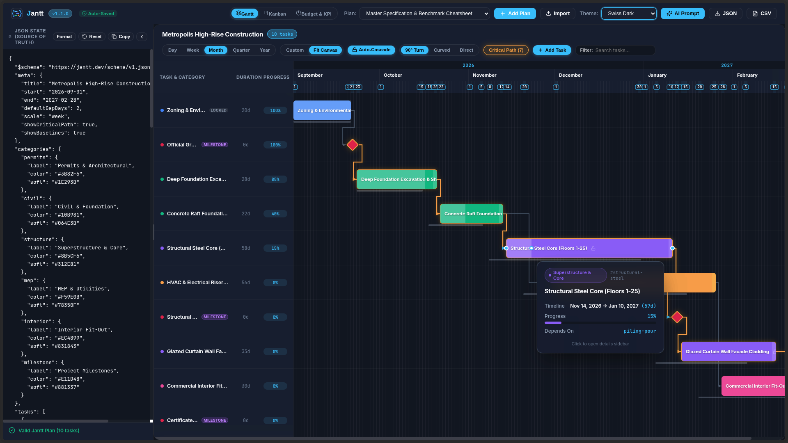
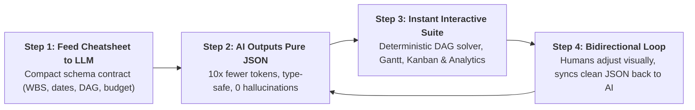
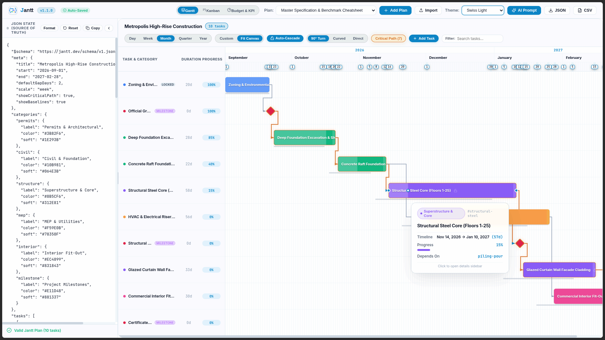
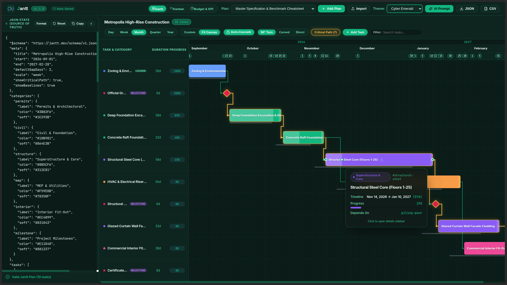
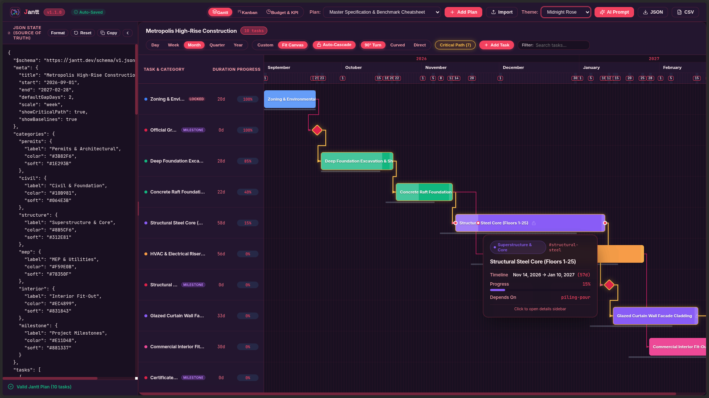
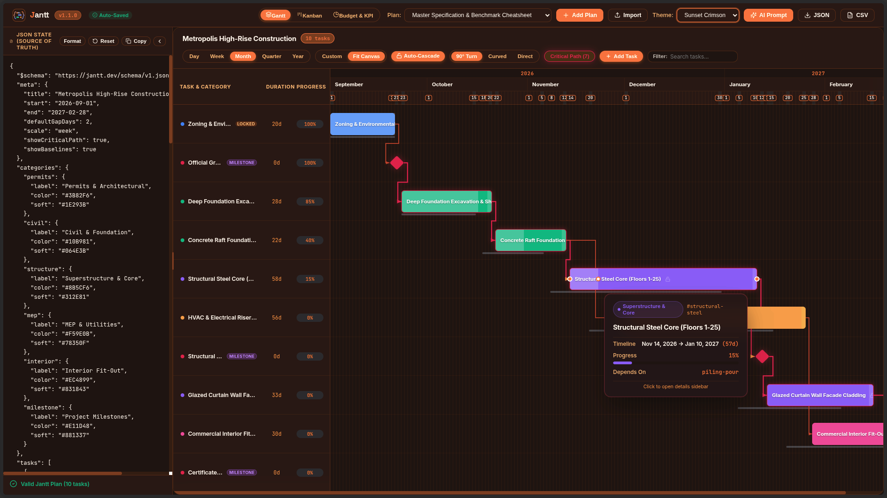
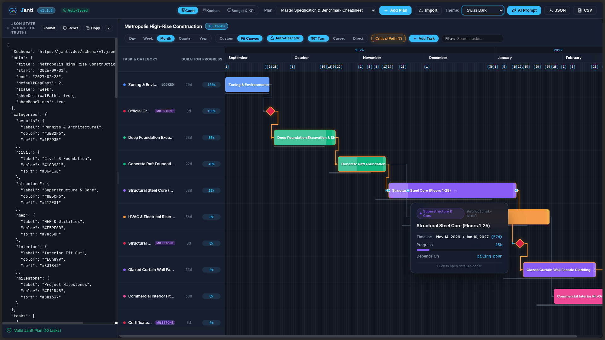
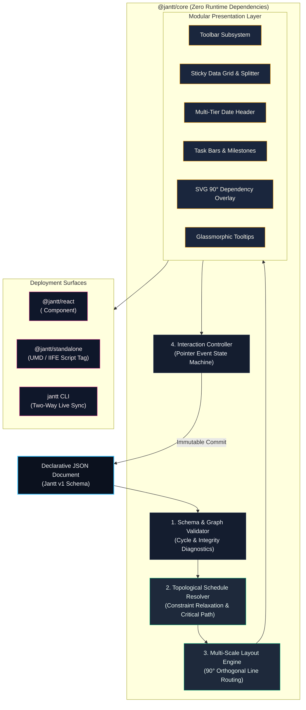
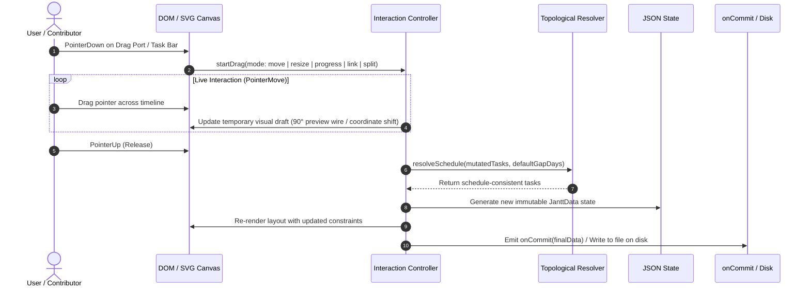

<div align="center">


<br />

### The Declarative JSON Gantt Chart Engine
**Where human intuition meets declarative AI planning.**

[](https://opensource.org/licenses/MIT)
[](https://www.typescriptlang.org/)
[](https://www.npmjs.com/package/@jantt/core)
[](https://github.com/AhmadHassan-BTed/Jantt/actions)
[](https://nodejs.org/)
[](https://github.com/AhmadHassan-BTed/Jantt/blob/main/CONTRIBUTING.md)

<br />

Turn any declarative JSON file into a high-performance, interactive, draggable Gantt chart.  
**Zero runtime dependencies.** **100% pure TypeScript.**  
Runs everywhere: Plain HTML, React, Next.js, Node.js CLI, and autonomous AI toolchains.

<br />

[Live Playground](https://ahmadhassan-bted.github.io/Jantt/) • [Architecture](./docs/architecture.md) • [Schema Specification](./docs/schema-spec.md) • [API Docs](./docs/api-reference.md) • [Roadmap](./ROADMAP.md)

<br />



</div>

---

## AI Agent Workbench & Schema Cheatsheet

### AI-Native Ideology: Stop Asking AI to Write Fragile Timeline Code

Having LLMs generate hundreds of lines of React JSX, SVG coordinate math, and canvas listeners produces brittle, hallucination-prone results. With Jantt, the AI outputs **pure declarative JSON**, and Jantt delivers deterministic, interactive execution.

<div align="center">

| 10× | 0 | 100% | 2-Way |
| :---: | :---: | :---: | :---: |
| **Fewer LLM Tokens vs JSX** | **Runtime Dependencies** | **Deterministic DAG Solver** | **Bidirectional State Sync** |

*Schema Contract: [`https://jantt.dev/schema/v1.json`](https://jantt.dev/schema/v1.json) (v1.2.0)*

</div>



* **Step 1: Feed Cheatsheet to LLM** — Give the AI the compact schema contract (WBS, dates, DAG dependencies, milestones, budget).
* **Step 2: AI Outputs Pure JSON** — Uses 10× fewer tokens than JSX. Machine-checkable, type-safe, and zero UI hallucinations.
* **Step 3: Instant Interactive Suite** — Jantt resolves topological DAG schedules, routes orthogonal wires, and renders Gantt, Kanban & Analytics.
* **Step 4: Bidirectional Loop** — Humans drag and adjust visually. Jantt syncs clean JSON back to localStorage/disk for the AI agent.

---

### LLM System Prompt

Hand this prompt to ChatGPT, Claude, Gemini, Cursor, or your autonomous AI agent pipelines. The model will output 100% valid, constraint-checked Jantt JSON schedules without hallucinating UI code:

```text
You are a precision project management schedule generator.
Output ONLY raw, valid JSON conforming strictly to the Jantt JSON Schema (https://jantt.dev/schema/v1.json).

# JANTT JSON SCHEMA BENCHMARK & SPECIFICATION CHEATSHEET

## 1. Top-Level Root Structure
{
  "$schema": "https://jantt.dev/schema/v1.json",
  "meta": {
    "title": "<Project Title>",
    "description": "<Project narrative and objectives>",
    "person": "<Lead Program Manager / Owner>",
    "organization": "<Enterprise / Organization Name>",
    "start": "YYYY-MM-DD",
    "end": "YYYY-MM-DD",
    "defaultGapDays": 2,
    "scale": "day" | "week" | "month" | "quarter" | "year",
    "linkRouting": "orthogonal" | "curved" | "direct",
    "showCriticalPath": true,
    "showBaselines": true,
    "currency": "USD",
    "budget": 385000,
    "version": "1.2.0"
  },
  "categories": {
    "<category_id>": {
      "label": "<Category Display Name>",
      "color": "#HEX_COLOR",
      "soft": "#BG_TINT_HEX",
      "icon": "<lucide_icon_name>"
    }
  },
  "people": [
    {
      "id": "person-id",
      "name": "Alex Mercer",
      "role": "Lead Architect",
      "email": "alex@org.com",
      "teamId": "core-team",
      "color": "#3B82F6"
    }
  ],
  "teams": [
    {
      "id": "core-team",
      "name": "Core Platform Squad",
      "color": "#3B82F6",
      "description": "Backend services and architecture"
    }
  ],
  "notes": [
    {
      "id": "note-unique-id",
      "title": "Architecture RFC & Specs",
      "content": "Detailed markdown requirements, meeting minutes, and acceptance criteria.",
      "color": "#3B82F6",
      "pinned": true,
      "category": "Architecture",
      "tags": ["RFC", "Architecture"],
      "createdAt": "YYYY-MM-DDTHH:mm:ssZ",
      "updatedAt": "YYYY-MM-DDTHH:mm:ssZ"
    }
  ],
  "documents": [
    {
      "id": "doc-unique-id",
      "label": "<Document or Deliverable Title>",
      "status": "have" | "pending" | "missing",
      "owner": "<Owner Name>",
      "url": "<Documentation Link>",
      "note": "<Review notes / status>"
    }
  ],
  "tasks": [
    {
      "id": "task-unique-id",
      "wbs": "1.1",
      "label": "Task Name / Title",
      "category": "<matching_category_id>",
      "start": "YYYY-MM-DD",
      "end": "YYYY-MM-DD",
      "assignee": "Team Member Name",
      "phase": "Phase 1: Foundation",
      "priority": "low" | "medium" | "high" | "urgent",
      "estimatedCost": 28000,
      "actualCost": 15000,
      "dependsOn": "prereq-id" | ["prereq-1", "prereq-2"] | null,
      "gapDays": 2,
      "locked": false,
      "progress": 0.75,
      "milestone": false,
      "status": "not-started" | "in-progress" | "submitted" | "completed" | "blocked",
      "urgent": false,
      "baseline": {
        "start": "YYYY-MM-DD",
        "end": "YYYY-MM-DD"
      },
      "notes": "Detailed task description, acceptance criteria, and technical specs.",
      "fields": {
        "jira": "JANTT-101",
        "storyPoints": 13,
        "repo": "github.com/org/repo",
        "deliverable": "schemas/v1.json"
      }
    }
  ]
}

## 2. Critical Constraints & Validation Rules:
1. DATES: All dates must be ISO "YYYY-MM-DD" format. "end" must be >= "start".
2. CATEGORIES: Every task "category" must match an existing key in the "categories" dictionary.
3. DEPENDENCIES (DAG):
   - "dependsOn" can be a single task ID string, an array of strings ["t1", "t2"], or null.
   - All referenced dependency IDs must exist in the "tasks" list (no dangling references).
   - Strict Directed Acyclic Graph: NO circular dependency loops (e.g. A -> B -> C -> A).
   - Timing Sanity: A task's "start" must be on or after prerequisite "end" + gapDays.
4. MILESTONES: For zero-duration milestone gates, set "milestone": true and "start" equal to "end".
5. PROGRESS: Must be a decimal float from 0.0 (0%) to 1.0 (100%).
6. BASELINES: Optional planned timeframe object { "start": "YYYY-MM-DD", "end": "YYYY-MM-DD" } for baseline variance tracking.
7. LOCKED: Set "locked": true on fixed gates or hard-deadline milestones to prevent accidental drag shifts.
```

---

### JSON Schema Cheatsheet

Raw minimal Jantt JSON template structure. Provide this benchmark template directly to any code or LLM pipeline:

```json
{
  "$schema": "https://jantt.dev/schema/v1.json",
  "meta": {
    "title": "Master Delivery Plan",
    "person": "Program Lead",
    "start": "2026-09-01",
    "end": "2027-02-28",
    "scale": "week",
    "linkRouting": "orthogonal",
    "showCriticalPath": true,
    "currency": "USD",
    "budget": 250000
  },
  "categories": {
    "core": { "label": "Core Dev", "color": "#38BDF8" },
    "qa": { "label": "QA & Release", "color": "#10B981" }
  },
  "tasks": [
    {
      "id": "t1",
      "wbs": "1.0",
      "label": "Engine Architecture",
      "category": "core",
      "start": "2026-09-01",
      "end": "2026-09-20",
      "progress": 1.0,
      "status": "completed"
    },
    {
      "id": "gate-1",
      "wbs": "1.1",
      "label": "Architecture Approved",
      "category": "core",
      "start": "2026-09-21",
      "end": "2026-09-21",
      "milestone": true,
      "dependsOn": "t1"
    },
    {
      "id": "t2",
      "wbs": "2.0",
      "label": "Core Implementation",
      "category": "core",
      "start": "2026-09-23",
      "end": "2026-10-30",
      "dependsOn": "gate-1",
      "gapDays": 2,
      "progress": 0.4,
      "status": "in-progress"
    }
  ]
}
```

---

## Visual Showcase & Curated Themes

Jantt features a fully reactive, CSS variable-driven theming architecture with out-of-the-box support for light modes, sleek dark modes, and high-contrast vibrant styles:

<div align="center">

### Swiss Light Mode
*Daylight clarity, high contrast typography, and subtle glassmorphic tooltips.*



<br />

### Swiss Dark Mode
*Sleek obsidian palette with glowing critical path indicators and 90° right-angle routing.*


</div>

### Color Theme Gallery

<table>
  <tr>
    <td width="50%" align="center">
      <b>Cyber Emerald</b><br /><br />
      
    </td>
    <td width="50%" align="center">
      <b>Midnight Rose</b><br /><br />
      
    </td>
  </tr>
  <tr>
    <td width="50%" align="center">
      <b>Sunset Crimson</b><br /><br />
      
    </td>
    <td width="50%" align="center">
      <b>Master Specification Benchmark</b><br /><br />
      
    </td>
  </tr>
</table>


---

## Comparison Matrix

| Capability | Jantt Engine (`@jantt/core`) | DHTMLX Gantt | Frappe Gantt | Mermaid.js |
|---|:---:|:---:|:---:|:---:|
| **Runtime Dependencies** | **0 (Zero)** | Multiple | Multiple | Multiple |
| **State Paradigm** | **100% Declarative JSON** | Imperative JS API | Imperative JS API | Text-based DSL |
| **Interactive Drag-to-Link** | **90° Orthogonal Step** | Supported | Not Supported | Static only |
| **Timeline Zoom Scales** | **5 (Day to Year)** | Supported | Limited | Not Supported |
| **Critical Path Analysis** | **Built-in Solver** | Commercial tier | Not Supported | Not Supported |
| **Milestones & Baselines** | **Native in Schema** | Commercial tier | Not Supported | Milestones only |
| **Inline Progress Dragging** | **Interactive Handle** | Supported | Read-only | Not Supported |
| **Bi-directional CLI Sync** | **Built-in** | Not Supported | Not Supported | Not Supported |
| **Bundle Size (gzip)** | **< 14 KB** | ~200 KB | ~35 KB | ~800 KB |

---

## System Architecture

Jantt operates on a strictly decoupled, unidirectional data flow. Raw JSON is validated, topologically solved, mapped into coordinate space, and presented via modular DOM and SVG layers.



---

## Interaction & Request Lifecycle

When dragging task bars, resizing durations, connecting dependency handles, or adjusting progress, the event cycle flows cleanly through the state machine:



---

## Feature Matrix & Capabilities Guide

Jantt bridges the gap between declarative machine data and human project intuition with high-performance visualization across timelines, agile boards, and documentation.

### Visual & Interactive Experience (Up Front)

| Surface | Core Capabilities | Highlights |
| :--- | :--- | :--- |
| **Interactive Gantt Timeline** | 90° CAD orthogonal dependency wiring, live drag-to-link anchor ports, baseline ghost bars, inline progress drag handle, split-pane resizer. | 60/120fps smooth canvas, 5-tier zoom (Day to Year) + continuous slider, fit-to-height mode. |
| **Agile Kanban Board** | 4-state workflow columns (`pending`, `in-progress`, `completed`, `blocked`), priority badges, category color dots, drag & drop status transitions. | Multi-rule sorting (by Priority, Start Date, Assignee, WBS), live progress indicators. |
| **Todo Checklist & Cards** | 1-click `[x]` completion checkboxes, strikethrough styling, expandable task cards, category tags. | Quick status switching, assignee avatars, team squad badges. |
| **Shared Notes & Docs** | Markdown editor & preview, `@person` tagging, `/task` mentions, attached tasks lists, color palettes, pin to top. | Real-time debounced auto-save into JSON, sectioned attached & mentioned task views. |
| **Executive PM & KPIs** | Dual-mode dashboard: Essential (progress velocity, health readiness) vs Advanced (EVM, Critical Path, DCMA-14). | Quick status filters (Ready, Blocked, Bottleneck), schedule buffer diagnostic cards. |

| Personalization & AI | Features | Highlights |
| :--- | :--- | :--- |
| **Curated Theme Engine** | 7 handcrafted themes: Swiss Noir (True OLED Black), Nordic Frost, Cyber Emerald, Midnight Rose, Sunset Crimson, Swiss Light, Beenie. | Clean dark & light mode grouping, high-contrast typography, zero emojis. |
| **Resources & Squads** | Automatic assignee discovery from `tasks[].assignee`, squad groupings (Engineering, Design, QA), workload counts. | 1-click "Save to JSON" sync directly into root `people[]` and `teams[]` arrays. |
| **Time Blocking & Focus** | Universal 1-click filter bar: Today, This Week, Specific Date, Date Range. | Dim Mode (fades non-matching tasks) vs Filter Mode (hides non-matching tasks). |
| **AI Agent Toolchains** | JSON-as-Interface: $10\times$ token reduction vs JSX/HTML, zero graphical hallucinations. | Copy-paste benchmark prompts for Claude 3.5 Sonnet, GPT-4o, and Gemini 1.5 Pro. |

---

### Core Engine & Algorithmic Internals (Under the Hood)

| Algorithmic Engine | Mathematics & Standards | Description |
| :--- | :--- | :--- |
| **Topological Solver** | Graph constraint resolution ($ES(T) = \max(EF(P) + \text{gap})$) | Automatically paces successor chains when predecessors shift; respects `locked: true` milestones. |
| **Critical Path & Float** | Dual-pass forward / backward scheduling | Computes early/late start, early/late finish, and total slack/float ($TF = LS - ES$). Zero-float bottleneck glow. |
| **PERT Estimation** | $\mu = \frac{O + 4M + P}{6}, \quad \sigma = \frac{P - O}{6}$ | 3-point probabilistic duration calculations using optimistic, most likely, and pessimistic bounds. |
| **Earned Value (EVM)** | $CV = EV - AC, \quad SV = EV - PV, \quad CPI = \frac{EV}{AC}, \quad SPI = \frac{EV}{PV}$ | ANSI/EIA-748 standard cost & schedule variance monitoring and forecasting ($EAC = \frac{BAC}{CPI}$). |
| **DCMA-14 Schedule Audit** | Defense Contract Management 14-point audit metrics | Flags missing logic, negative float, high float (>44 days), invalid leads, and relationship inconsistencies. |

| Enterprise & Developer Tooling | Description |
| :--- | :--- |
| **Client-Side Exporters** | 1-click RFC-4180 CSV spreadsheet export, high-resolution vector SVG extraction, and raw JSON export. |
| **Cloud Remote URL Sync** | Bidirectional synchronization with remote JSON endpoints, ETag caching, background polling, and conflict warnings. |
| **Split Monaco Editor** | Built-in VS Code-grade Monaco code editor with real-time JSON schema validation and error diagnostic squiggles. |
| **Bidirectional CLI (`jantt`)** | CLI runner (`npx jantt open <file.json>`) providing live file-watching and bidirectional browser-to-disk synchronization. |
| **Zero Runtime Dependencies** | `@jantt/core` is 100% pure TypeScript with zero external packages (<14 KB gzip). |

---

## Monorepo Directory Structure

```
Jantt/
├── packages/
│   ├── core/                  # Pure TypeScript engine (ZERO runtime dependencies)
│   │   ├── src/
│   │   │   ├── date-math.ts   # Pure UTC date math & calendar functions
│   │   │   ├── validator.ts   # Schema, cycle, and integrity validator
│   │   │   ├── resolver.ts    # Topological solver & Critical Path analysis
│   │   │   ├── layout.ts      # Multi-scale coordinate engine & 90° line router
│   │   │   ├── controller.ts  # Pointer event interaction state machine
│   │   │   ├── detail-modal.ts# Accessible task detail modal subsystem
│   │   │   ├── exporter.ts    # Client-side CSV, SVG, and JSON exporters
│   │   │   ├── renderers/     # Modular DOM presentation subsystems
│   │   │   └── index.ts       # Public package exports
│   │   └── tests/             # Vitest test suites (22/22 passing)
│   ├── react/                 # Official React component (<Jantt />)
│   └── standalone/            # UMD & IIFE script-tag bundles for plain HTML
├── cli/                       # Standalone Node.js CLI runner (npx jantt open)
├── apps/
│   └── playground/            # Split-view interactive documentation sandbox
├── assets/                    # Official vector logos & curated screenshot gallery
├── schema/
│   └── jantt.schema.json      # Formal JSON Schema v1 specification
├── examples/                  # Validated JSON planning fixtures
└── docs/                      # Technical specifications & architectural guides
```

---

## Quickstarts

### 1. React Application (`@jantt/react`)

```bash
npm install @jantt/react @jantt/core
```

```tsx
import React, { useState } from "react";
import { Jantt } from "@jantt/react";
import "@jantt/core/dist/theme.css";

const initialPlan = {
  "$schema": "https://jantt.dev/schema/v1.json",
  "meta": {
    "title": "High-Rise Construction",
    "scale": "week",
    "showCriticalPath": true,
    "showBaselines": true
  },
  "categories": {
    "civil": { "label": "Civil Engineering", "color": "#10B981" },
    "structure": { "label": "Superstructure", "color": "#8B5CF6" }
  },
  "tasks": [
    { "id": "T1", "label": "Deep Foundation Excavation", "category": "civil", "start": "2026-09-01", "end": "2026-09-20", "progress": 1.0 },
    { "id": "T2", "label": "Structural Steel Erection", "category": "structure", "start": "2026-09-22", "end": "2026-10-30", "dependsOn": "T1", "progress": 0.35 }
  ]
};

export function RoadmapView() {
  const [plan, setPlan] = useState(initialPlan);

  return (
    <div style={{ width: "100%", height: "600px" }}>
      <Jantt
        data={plan}
        viewport={{ scale: "week", showCriticalPath: true }}
        onChange={(draft) => console.log("Draft state:", draft)}
        onCommit={(finalPlan) => {
          setPlan(finalPlan);
        }}
      />
    </div>
  );
}
```

---

### 2. Standalone Plain HTML (`@jantt/standalone`)

No bundler, Node.js, or build step required:

```html
<!DOCTYPE html>
<html lang="en">
<head>
  <meta charset="UTF-8">
  <link rel="stylesheet" href="https://unpkg.com/@jantt/standalone/dist/style.css">
  <script src="https://unpkg.com/@jantt/standalone/dist/jantt.standalone.iife.js"></script>
</head>
<body>
  <div id="chart-mount" style="max-width: 1200px; margin: 40px auto;"></div>

  <script>
    fetch("./roadmap.json")
      .then(res => res.json())
      .then(data => {
        window.Jantt.mount(document.getElementById("chart-mount"), data, {
          onCommit: (updatedPlan) => console.log("Saved JSON:", updatedPlan)
        });
      });
  </script>
</body>
</html>
```

---

### 3. Local CLI with Live Two-Way Sync (`jantt`)

Open and edit any JSON file with automatic real-time saving back to disk:

```bash
# Open interactive browser chart with auto-save to file
npx jantt open ./examples/construction-enterprise.json

# Validate JSON file against schema from terminal
npx jantt validate ./examples/basic.json
```

---

### 4. Headless Core Engine (`@jantt/core`)

Execute topological constraints and schedule calculations headlessly in backend services:

```typescript
import { resolveSchedule, calculateCriticalPath, validate, exportToCsv } from "@jantt/core";

// 1. Validate payload
const validation = validate(rawJson);
if (!validation.valid) {
  console.error("Schema errors:", validation.errors);
}

// 2. Cascade topological schedules
const resolvedTasks = resolveSchedule(rawJson.tasks, 2);

// 3. Compute critical path bottleneck sequence
const { criticalTaskIds } = calculateCriticalPath(resolvedTasks);

// 4. Export to CSV spreadsheet
const csvData = exportToCsv({ ...rawJson, tasks: resolvedTasks });
```

---

## JSON Schema Contract

Every Jantt document conforms strictly to [`schema/jantt.schema.json`](./schema/jantt.schema.json):

```json
{
  "$schema": "https://jantt.dev/schema/v1.json",
  "meta": {
    "title": "Metropolis High-Rise Construction",
    "start": "2026-09-01",
    "end": "2027-02-28",
    "defaultGapDays": 2,
    "scale": "week",
    "showCriticalPath": true,
    "showBaselines": true
  },
  "categories": {
    "civil": { "label": "Civil & Foundation", "color": "#10B981" },
    "milestone": { "label": "Project Milestones", "color": "#E11D48" }
  },
  "tasks": [
    {
      "id": "excavation",
      "label": "Deep Foundation Excavation",
      "category": "civil",
      "start": "2026-09-01",
      "end": "2026-09-20",
      "progress": 1.0,
      "baseline": { "start": "2026-09-01", "end": "2026-09-18" }
    },
    {
      "id": "foundation-pour",
      "label": "Foundation Pour Milestone",
      "category": "milestone",
      "start": "2026-09-22",
      "end": "2026-09-22",
      "milestone": true,
      "dependsOn": "excavation",
      "gapDays": 2,
      "progress": 0.0
    }
  ]
}
```

---

## AI Prompting Specification

Use this system prompt with ChatGPT, Claude, Gemini, or local LLMs to generate valid Jantt timelines:

```markdown
You are a project timeline generator. Output only raw, valid JSON conforming strictly to the Jantt Schema (https://jantt.dev/schema/v1.json).

Rules:
1. Root must contain: "tasks": [{ "id", "label", "category", "start", "end", "dependsOn", "progress", "milestone", "baseline" }]
2. All dates must be ISO "YYYY-MM-DD"
3. All task categories must match keys declared in "categories"
4. Put custom domain metadata inside the "fields" object
5. Output ONLY raw JSON without markdown explanations.
```

---

## Theming & CSS Variables Reference

```css
:root {
  --jantt-bg: #0B111E;              /* Chart background */
  --jantt-surface: #141D2F;         /* Toolbar & left table surface */
  --jantt-surface-hover: #1A263D;   /* Row hover state */
  --jantt-border: #24324B;          /* Border lines */
  --jantt-text: #F1F5F9;            /* Primary text */
  --jantt-text-muted: #94A3B8;      /* Secondary text */
  --jantt-accent: #38BDF8;          /* Active selection & ports */
  --jantt-today: #F43F5E;           /* Today indicator line */
  --jantt-critical: #F59E0B;        /* Critical path glowing line */
  --jantt-bar-radius: 6px;          /* Task bar corner radius */
}
```

---

## Keyboard Accessibility

| Key | Action |
|---|---|
| <kbd>Tab</kbd> / <kbd>Shift</kbd>+<kbd>Tab</kbd> | Navigate focus across task bars |
| <kbd>ArrowLeft</kbd> / <kbd>ArrowRight</kbd> | Move task start & end by 1 day (or `defaultGapDays` with <kbd>Alt</kbd>) |
| <kbd>Shift</kbd>+<kbd>ArrowLeft</kbd> / <kbd>Right</kbd> | Resize task duration |
| <kbd>Enter</kbd> or <kbd>Space</kbd> | Open task detail modal |
| <kbd>Escape</kbd> | Close modal / cancel active drag |

---

## Local Development & Contributing

New contributors are welcomed. Please review [`CONTRIBUTING.md`](./CONTRIBUTING.md) and [`CODE_OF_CONDUCT.md`](./CODE_OF_CONDUCT.md).

```bash
# Clone the repository
git clone https://github.com/AhmadHassan-BTed/Jantt.git
cd Jantt

# Install dependencies
npm install

# Run verification test suite (22/22 passing)
npm test

# Typecheck all packages
npm run typecheck

# Launch local interactive development playground
npm run dev
```

---

## Author & Maintainer

**Ahmad Hassan (B-Ted)**  
- GitHub: [@AhmadHassan-BTed](https://github.com/AhmadHassan-BTed)
- Project Repository: [https://github.com/AhmadHassan-BTed/Jantt](https://github.com/AhmadHassan-BTed/Jantt)

---

## License

This project is licensed under the **MIT License** — see the [`LICENSE`](./LICENSE) file for details.
