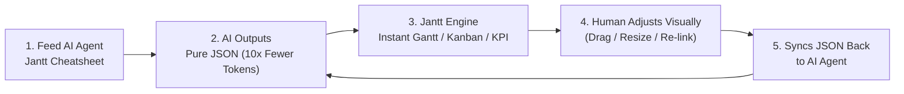
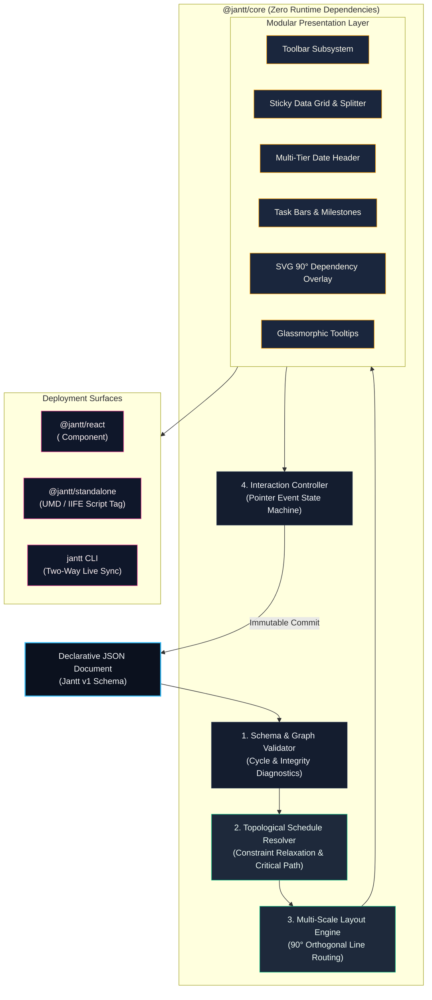
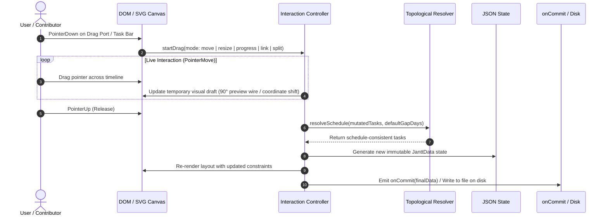

<div align="center">


<br />

### The Declarative JSON Gantt Chart Engine
**Where human intuition meets declarative AI planning.**

[](https://opensource.org/licenses/MIT)
[](https://www.typescriptlang.org/)
[](https://www.npmjs.com/package/@jantt/core)
[](https://github.com/AhmadHassan-BTed/Jantt/actions)
[](https://nodejs.org/)
[](https://github.com/AhmadHassan-BTed/Jantt/blob/main/CONTRIBUTING.md)

<br />

Turn any declarative JSON file into a high-performance, interactive, draggable Gantt chart.  
**Zero runtime dependencies.** **100% pure TypeScript.**  
Runs everywhere: Plain HTML, React, Next.js, Node.js CLI, and autonomous AI toolchains.

<br />

[Live Playground](https://ahmadhassan-bted.github.io/Jantt/) • [Architecture](./docs/architecture.md) • [Schema Specification](./docs/schema-spec.md) • [API Docs](./docs/api-reference.md) • [Roadmap](./ROADMAP.md)

<br />


</div>

---

## Built for AI Agents: Stop Generating Brittle Timeline Code

**The traditional approach to AI project schedules is broken:**
* Asking LLMs (ChatGPT, Claude, Gemini, Cursor) to generate custom UI code (React JSX, SVG coordinate math, CSS grid positioning, canvas listeners) produces **500+ lines of fragile, hallucination-prone code**.
* Dates drift, dependency wires misalign, drag listeners break, and massive context windows are wasted on throwaway UI boilerplate.

### The Jantt Paradigm: JSON-as-Interface for AI



1. **Feed the Cheatsheet**: Provide your AI agent with the lightweight **Jantt JSON Schema Cheatsheet**.
2. **AI Outputs Pure JSON**: The model outputs structured, machine-verifiable data ($10\times$ fewer tokens than JSX, zero UI hallucinations).
3. **Instant Zero-Code Execution**: Jantt parses the schema, solves DAG topological dependencies, routes 90° orthogonal links, and renders an interactive Gantt timeline, Kanban board, and KPI analytics suite.
4. **Bidirectional Human-in-the-Loop**: The user visually tweaks dates, drags progress, and re-wires dependencies. Jantt immediately writes the updated state back to clean JSON to pipe straight back into the AI agent.

### The AI Benchmark Cheatsheet (Ready to Copy)

```json
{
  "$schema": "https://jantt.dev/schema/v1.json",
  "meta": {
    "title": "Master Delivery Plan",
    "person": "Program Lead",
    "start": "2026-09-01",
    "end": "2027-02-28",
    "scale": "week",
    "linkRouting": "orthogonal",
    "showCriticalPath": true,
    "currency": "USD",
    "budget": 250000
  },
  "categories": {
    "core": { "label": "Core Dev", "color": "#38BDF8" },
    "qa": { "label": "QA & Release", "color": "#10B981" }
  },
  "tasks": [
    {
      "id": "t1",
      "wbs": "1.0",
      "label": "Engine Architecture",
      "category": "core",
      "start": "2026-09-01",
      "end": "2026-09-20",
      "progress": 1.0,
      "status": "completed"
    },
    {
      "id": "gate-1",
      "wbs": "1.1",
      "label": "Architecture Approved",
      "category": "core",
      "start": "2026-09-21",
      "end": "2026-09-21",
      "milestone": true,
      "dependsOn": "t1"
    },
    {
      "id": "t2",
      "wbs": "2.0",
      "label": "Core Implementation",
      "category": "core",
      "start": "2026-09-23",
      "end": "2026-10-30",
      "dependsOn": "gate-1",
      "gapDays": 2,
      "progress": 0.4,
      "status": "in-progress"
    }
  ]
}
```

---

## Visual Showcase & Curated Themes

Jantt features a fully reactive, CSS variable-driven theming architecture with out-of-the-box support for light modes, sleek dark modes, and high-contrast vibrant styles:

<div align="center">

### Swiss Light Mode
*Daylight clarity, high contrast typography, and subtle glassmorphic tooltips.*


<br />

### Swiss Dark Mode
*Sleek obsidian palette with glowing critical path indicators and 90° right-angle routing.*


</div>

### Color Theme Gallery

<table>
  <tr>
    <td width="50%" align="center">
      <b>Cyber Emerald</b><br /><br />
      
    </td>
    <td width="50%" align="center">
      <b>Midnight Rose</b><br /><br />
      
    </td>
  </tr>
  <tr>
    <td width="50%" align="center">
      <b>Sunset Crimson</b><br /><br />
      
    </td>
    <td width="50%" align="center">
      <b>Master Specification Benchmark</b><br /><br />
      
    </td>
  </tr>
</table>


---

## Comparison Matrix

| Capability | Jantt Engine (`@jantt/core`) | DHTMLX Gantt | Frappe Gantt | Mermaid.js |
|---|:---:|:---:|:---:|:---:|
| **Runtime Dependencies** | **0 (Zero)** | Multiple | Multiple | Multiple |
| **State Paradigm** | **100% Declarative JSON** | Imperative JS API | Imperative JS API | Text-based DSL |
| **Interactive Drag-to-Link** | **90° Orthogonal Step** | Supported | Not Supported | Static only |
| **Timeline Zoom Scales** | **5 (Day to Year)** | Supported | Limited | Not Supported |
| **Critical Path Analysis** | **Built-in Solver** | Commercial tier | Not Supported | Not Supported |
| **Milestones & Baselines** | **Native in Schema** | Commercial tier | Not Supported | Milestones only |
| **Inline Progress Dragging** | **Interactive Handle** | Supported | Read-only | Not Supported |
| **Bi-directional CLI Sync** | **Built-in** | Not Supported | Not Supported | Not Supported |
| **Bundle Size (gzip)** | **< 14 KB** | ~200 KB | ~35 KB | ~800 KB |

---

## System Architecture

Jantt operates on a strictly decoupled, unidirectional data flow. Raw JSON is validated, topologically solved, mapped into coordinate space, and presented via modular DOM and SVG layers.



---

## Interaction & Request Lifecycle

When dragging task bars, resizing durations, connecting dependency handles, or adjusting progress, the event cycle flows cleanly through the state machine:



---

## Feature Matrix & Capabilities Guide

Jantt bridges the gap between declarative machine data and human project intuition. Below is a comprehensive overview of its core capabilities:

### 1. High-Performance Core Engine (`@jantt/core`)
* **Zero Runtime Dependencies**: 100% pure TypeScript. No external libraries, no D3 overhead, no heavy bloated chart dependencies (<14 KB gzip).
* **Deterministic Layout & 60/120fps Rendering**: Coordinated `requestAnimationFrame` render cycles eliminate layout thrashing, frame drops, and cursor stutter during high-speed timeline scrubbing.
* **Topological Schedule Cascade Resolver**: Graph-based constraint solver with multi-predecessor pacing ($ES(T) = \max(EF(P) + \text{gap})$). Downstream tasks shift automatically when predecessors move, while `locked: true` milestones remain fixed reference points.
* **Algorithmic Critical Path & Float Calculation**: Dual-pass forward/backward scheduling computes total slack/float. Tasks with zero float are highlighted with an illuminating bottleneck glow to identify schedule-dictating sequences.

### 2. Interactive Gantt Timeline
* **Interactive Drag-to-Link (90° Orthogonal CAD Routing)**: Hovering any task reveals circular connector anchor ports. Dragging an anchor port draws an interactive live wire; dropping it onto a successor establishes a `dependsOn` link with professional CAD-style right-angle routing.
* **Multi-Scale Timeline Zoom (5 Tiers + Continuous Slider)**: Switch seamlessly between **Day View** (36px/day), **Week View** (18px/day), **Month View** (7px/day), **Quarter View** (3px/day), and **Year View** (1.5px/day), or drag the continuous slider with cursor-anchored focus.
* **Milestone Diamonds & Baseline Comparison Ghost Bars**:
  * Milestones (`milestone: true` or duration 0) render as 45° rotated diamond checkpoints.
  * Baseline comparisons (`baseline: { start, end }`) render subtle ghost bars beneath active tasks for immediate planned-vs-actual variance tracking.
* **Inline Progress Drag Handle**: Intuitive handle directly on the task bar allows dragging completion from 0% to 100% without opening modals.
* **Draggable Splitter & Fit-to-Height Mode**: Resizable boundary between table columns and timeline canvas, with optional "Fit" mode dynamically adjusting row heights to fit within the viewport without vertical scrolling.

### 3. Multi-View Interactive Workspace
* **Gantt Chart View**: Full timeline schedule with sticky data grid, interactive dependency wires, and multi-tier date headers.
* **Interactive Kanban Board**: Visual workflow columns (`pending`, `in-progress`, `completed`, `blocked`) featuring priority tags, category color accents, live progress updates, and multi-sort rules (by priority, start date, assignee, WBS).
* **Tasks Checklist & Cards View**:
  * **Todo Checklist**: Clean interactive task list with 1-click `[x]` completion checkboxes, automatic strikethroughs, and category tags.
  * **Task Cards**: Detailed cards with progress bars, assignee avatars, team badges, and quick status actions.
* **Budget & KPI Analytics View**: High-level executive dashboard tracking total budget, estimated cost, actual spend, cost variance, completion velocity, and deliverable readiness.

### 4. Built for AI Agents & LLM Toolchains
* **JSON-as-Interface**: Outputting structured JSON consumes **$10\times$ fewer tokens** than fragile React JSX or HTML canvas boilerplate.
* **Zero UI Hallucinations**: Language models focus purely on data logic, milestones, and dates. Jantt guarantees deterministic math, valid layouts, and error-free graphics.
* **AI Benchmark Cheatsheet**: Copy-paste reference schema optimized for ChatGPT, Claude 3.5 Sonnet, Gemini 1.5 Pro, and Cursor.
* **Bidirectional Human-in-the-Loop Roundtrip**: Humans visually drag dates, toggle checkboxes, or re-link tasks; Jantt immediately serializes clean, validated JSON back to disk or agent context.

### 5. Academic & Student Application Pipeline Planning
* **Concurrency & Deadline Management**: Designed to coordinate complex academic pipelines (such as PhD/MS admissions, scholarship applications, thesis research, and visa milestones).
* **Funding & Fellowship Monitoring**: Track DAAD, Fulbright, SINGA, KAIST, Commonwealth, and university-specific funding deadlines side-by-side with required credential checklists.
* **Estimated vs Confirmed Milestones**: Visual distinction between hard application cutoffs and rolling admission windows.
* **Document Checklists (`documents[]`)**: Embedded credential tracking for transcripts, SOPs, GRE/IELTS score reports, and referee recommendation letters.

### 6. Personal Productivity & Time Blocking
* **Universal Date Filter Subheader**: 1-click focus presets across all views:
  * **Today**: Instant focus on tasks active today.
  * **This Week**: Sprint focus for Monday through Sunday.
  * **Pick Date**: Target a specific deadline or milestone day.
  * **Date Range**: Filter between start and end boundaries.
* **Dim vs Filter Focus Modes**: Switch between **Dim Mode** (fades non-matching tasks to maintain timeline context) and **Filter Mode** (completely hides non-matching items for distraction-free execution).

### 7. People, Teams & Automatic Assignee Discovery
* **Auto-Discovery Engine**: Automatically scans `meta.person`, `tasks[].assignee`, and `documents[].owner` to register team members with unique avatar colors and task counts.
* **1-Click JSON Persistence**: Discovered assignees feature a `Save to JSON` button to write clean `Person` entries into the JSON schema's root `"people"` array.
* **Team Squad Management**: Group team members into squads (Engineering, QA, Design, Operations) for workload filtering and assignee avatars.

### 8. Developer & Enterprise Tooling
* **Client-Side High-Res Exporters**: One-click RFC-4180 CSV spreadsheet export (`exportToCsv`), vector SVG extraction, and JSON file downloads.
* **Remote Cloud URL Sync**: Bidirectional sync between local state and remote JSON endpoints with automatic polling, conflict detection, and ETag caching.
* **Split Monaco JSON Editor**: Embedded VS Code-grade code editor with real-time JSON schema validation, error tooltips, and sync glow indicator.
* **Bi-directional CLI (`jantt`)**: Live two-way synchronization between local JSON files on disk and the browser UI.

---

## Monorepo Directory Structure

```
Jantt/
├── packages/
│   ├── core/                  # Pure TypeScript engine (ZERO runtime dependencies)
│   │   ├── src/
│   │   │   ├── date-math.ts   # Pure UTC date math & calendar functions
│   │   │   ├── validator.ts   # Schema, cycle, and integrity validator
│   │   │   ├── resolver.ts    # Topological solver & Critical Path analysis
│   │   │   ├── layout.ts      # Multi-scale coordinate engine & 90° line router
│   │   │   ├── controller.ts  # Pointer event interaction state machine
│   │   │   ├── detail-modal.ts# Accessible task detail modal subsystem
│   │   │   ├── exporter.ts    # Client-side CSV, SVG, and JSON exporters
│   │   │   ├── renderers/     # Modular DOM presentation subsystems
│   │   │   └── index.ts       # Public package exports
│   │   └── tests/             # Vitest test suites (22/22 passing)
│   ├── react/                 # Official React component (<Jantt />)
│   └── standalone/            # UMD & IIFE script-tag bundles for plain HTML
├── cli/                       # Standalone Node.js CLI runner (npx jantt open)
├── apps/
│   └── playground/            # Split-view interactive documentation sandbox
├── assets/                    # Official vector logos & curated screenshot gallery
├── schema/
│   └── jantt.schema.json      # Formal JSON Schema v1 specification
├── examples/                  # Validated JSON planning fixtures
└── docs/                      # Technical specifications & architectural guides
```

---

## Quickstarts

### 1. React Application (`@jantt/react`)

```bash
npm install @jantt/react @jantt/core
```

```tsx
import React, { useState } from "react";
import { Jantt } from "@jantt/react";
import "@jantt/core/dist/theme.css";

const initialPlan = {
  "$schema": "https://jantt.dev/schema/v1.json",
  "meta": {
    "title": "High-Rise Construction",
    "scale": "week",
    "showCriticalPath": true,
    "showBaselines": true
  },
  "categories": {
    "civil": { "label": "Civil Engineering", "color": "#10B981" },
    "structure": { "label": "Superstructure", "color": "#8B5CF6" }
  },
  "tasks": [
    { "id": "T1", "label": "Deep Foundation Excavation", "category": "civil", "start": "2026-09-01", "end": "2026-09-20", "progress": 1.0 },
    { "id": "T2", "label": "Structural Steel Erection", "category": "structure", "start": "2026-09-22", "end": "2026-10-30", "dependsOn": "T1", "progress": 0.35 }
  ]
};

export function RoadmapView() {
  const [plan, setPlan] = useState(initialPlan);

  return (
    <div style={{ width: "100%", height: "600px" }}>
      <Jantt
        data={plan}
        viewport={{ scale: "week", showCriticalPath: true }}
        onChange={(draft) => console.log("Draft state:", draft)}
        onCommit={(finalPlan) => {
          setPlan(finalPlan);
        }}
      />
    </div>
  );
}
```

---

### 2. Standalone Plain HTML (`@jantt/standalone`)

No bundler, Node.js, or build step required:

```html
<!DOCTYPE html>
<html lang="en">
<head>
  <meta charset="UTF-8">
  <link rel="stylesheet" href="https://unpkg.com/@jantt/standalone/dist/style.css">
  <script src="https://unpkg.com/@jantt/standalone/dist/jantt.standalone.iife.js"></script>
</head>
<body>
  <div id="chart-mount" style="max-width: 1200px; margin: 40px auto;"></div>

  <script>
    fetch("./roadmap.json")
      .then(res => res.json())
      .then(data => {
        window.Jantt.mount(document.getElementById("chart-mount"), data, {
          onCommit: (updatedPlan) => console.log("Saved JSON:", updatedPlan)
        });
      });
  </script>
</body>
</html>
```

---

### 3. Local CLI with Live Two-Way Sync (`jantt`)

Open and edit any JSON file with automatic real-time saving back to disk:

```bash
# Open interactive browser chart with auto-save to file
npx jantt open ./examples/construction-enterprise.json

# Validate JSON file against schema from terminal
npx jantt validate ./examples/basic.json
```

---

### 4. Headless Core Engine (`@jantt/core`)

Execute topological constraints and schedule calculations headlessly in backend services:

```typescript
import { resolveSchedule, calculateCriticalPath, validate, exportToCsv } from "@jantt/core";

// 1. Validate payload
const validation = validate(rawJson);
if (!validation.valid) {
  console.error("Schema errors:", validation.errors);
}

// 2. Cascade topological schedules
const resolvedTasks = resolveSchedule(rawJson.tasks, 2);

// 3. Compute critical path bottleneck sequence
const { criticalTaskIds } = calculateCriticalPath(resolvedTasks);

// 4. Export to CSV spreadsheet
const csvData = exportToCsv({ ...rawJson, tasks: resolvedTasks });
```

---

## JSON Schema Contract

Every Jantt document conforms strictly to [`schema/jantt.schema.json`](./schema/jantt.schema.json):

```json
{
  "$schema": "https://jantt.dev/schema/v1.json",
  "meta": {
    "title": "Metropolis High-Rise Construction",
    "start": "2026-09-01",
    "end": "2027-02-28",
    "defaultGapDays": 2,
    "scale": "week",
    "showCriticalPath": true,
    "showBaselines": true
  },
  "categories": {
    "civil": { "label": "Civil & Foundation", "color": "#10B981" },
    "milestone": { "label": "Project Milestones", "color": "#E11D48" }
  },
  "tasks": [
    {
      "id": "excavation",
      "label": "Deep Foundation Excavation",
      "category": "civil",
      "start": "2026-09-01",
      "end": "2026-09-20",
      "progress": 1.0,
      "baseline": { "start": "2026-09-01", "end": "2026-09-18" }
    },
    {
      "id": "foundation-pour",
      "label": "Foundation Pour Milestone",
      "category": "milestone",
      "start": "2026-09-22",
      "end": "2026-09-22",
      "milestone": true,
      "dependsOn": "excavation",
      "gapDays": 2,
      "progress": 0.0
    }
  ]
}
```

---

## AI Prompting Specification

Use this system prompt with ChatGPT, Claude, Gemini, or local LLMs to generate valid Jantt timelines:

```markdown
You are a project timeline generator. Output only raw, valid JSON conforming strictly to the Jantt Schema (https://jantt.dev/schema/v1.json).

Rules:
1. Root must contain: "tasks": [{ "id", "label", "category", "start", "end", "dependsOn", "progress", "milestone", "baseline" }]
2. All dates must be ISO "YYYY-MM-DD"
3. All task categories must match keys declared in "categories"
4. Put custom domain metadata inside the "fields" object
5. Output ONLY raw JSON without markdown explanations.
```

---

## Theming & CSS Variables Reference

```css
:root {
  --jantt-bg: #0B111E;              /* Chart background */
  --jantt-surface: #141D2F;         /* Toolbar & left table surface */
  --jantt-surface-hover: #1A263D;   /* Row hover state */
  --jantt-border: #24324B;          /* Border lines */
  --jantt-text: #F1F5F9;            /* Primary text */
  --jantt-text-muted: #94A3B8;      /* Secondary text */
  --jantt-accent: #38BDF8;          /* Active selection & ports */
  --jantt-today: #F43F5E;           /* Today indicator line */
  --jantt-critical: #F59E0B;        /* Critical path glowing line */
  --jantt-bar-radius: 6px;          /* Task bar corner radius */
}
```

---

## Keyboard Accessibility

| Key | Action |
|---|---|
| <kbd>Tab</kbd> / <kbd>Shift</kbd>+<kbd>Tab</kbd> | Navigate focus across task bars |
| <kbd>ArrowLeft</kbd> / <kbd>ArrowRight</kbd> | Move task start & end by 1 day (or `defaultGapDays` with <kbd>Alt</kbd>) |
| <kbd>Shift</kbd>+<kbd>ArrowLeft</kbd> / <kbd>Right</kbd> | Resize task duration |
| <kbd>Enter</kbd> or <kbd>Space</kbd> | Open task detail modal |
| <kbd>Escape</kbd> | Close modal / cancel active drag |

---

## Local Development & Contributing

New contributors are welcomed. Please review [`CONTRIBUTING.md`](./CONTRIBUTING.md) and [`CODE_OF_CONDUCT.md`](./CODE_OF_CONDUCT.md).

```bash
# Clone the repository
git clone https://github.com/AhmadHassan-BTed/Jantt.git
cd Jantt

# Install dependencies
npm install

# Run verification test suite (22/22 passing)
npm test

# Typecheck all packages
npm run typecheck

# Launch local interactive development playground
npm run dev
```

---

## Author & Maintainer

**Ahmad Hassan (B-Ted)**  
- GitHub: [@AhmadHassan-BTed](https://github.com/AhmadHassan-BTed)
- Project Repository: [https://github.com/AhmadHassan-BTed/Jantt](https://github.com/AhmadHassan-BTed/Jantt)

---

## License

This project is licensed under the **MIT License** — see the [`LICENSE`](./LICENSE) file for details.
