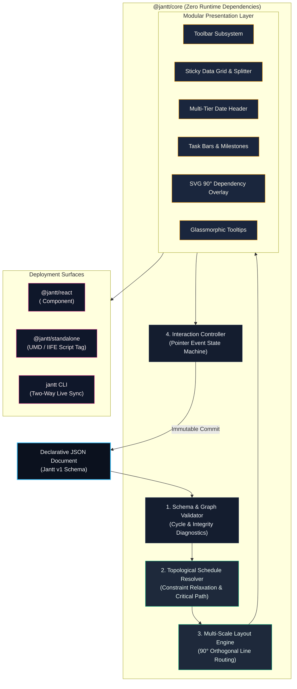
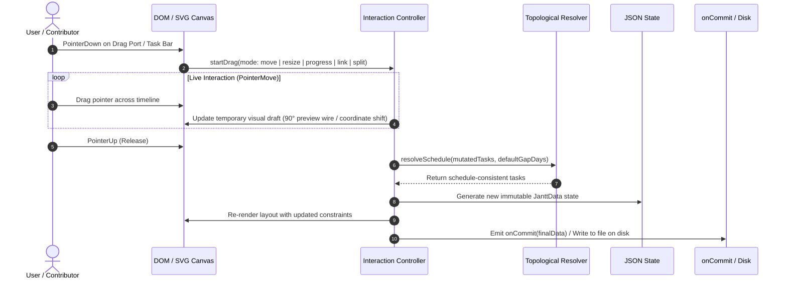

<div align="center">

# Jantt
### The JSON Gantt Chart Engine

**Where human intuition meets declarative AI planning.**

[](https://opensource.org/licenses/MIT)
[](https://www.typescriptlang.org/)
[](https://www.npmjs.com/package/@jantt/core)
[](https://github.com/AhmadHassan-BTed/Jantt/actions)
[](https://nodejs.org/)
[](https://github.com/AhmadHassan-BTed/Jantt/blob/main/CONTRIBUTING.md)

<br />

Turn any declarative JSON file into a high-performance, interactive, draggable Gantt chart.  
**Zero runtime dependencies.** **100% pure TypeScript.**  
Runs everywhere: Plain HTML, React, Next.js, Node.js CLI, and autonomous AI toolchains.

<br />

[Live Sandbox](http://localhost:5173/) • [Architecture](./docs/architecture.md) • [Schema Specification](./docs/schema-spec.md) • [API Docs](./docs/api-reference.md) • [Roadmap](./ROADMAP.md)

</div>

---

## The Vision

Planning is deeply human. Milestones, deadlines, and project roadmaps represent real effort, coordination, and aspirations. In modern software engineering, schedules are increasingly drafted, refined, and reorganized by **AI models** before human review.

There has long been a gap between AI-generated plans and visual human intuition:
- **Static text and markdown tables** fail to communicate temporal relationships, overlaps, or bottlenecks.
- **Legacy Gantt libraries** require hundreds of lines of imperative setup code, proprietary SDK APIs, and heavy runtime dependencies.
- **State synchronization is brittle**: syncing visual adjustments back to disk or piping incremental AI edits into a UI is historically complex.

**Jantt bridges this divide.**

> **The JSON file is the application state.**  
> What an AI outputs, Jantt renders immediately. What a human drags, resizes, or links on screen, Jantt writes straight back to clean, portable JSON.

---

## Comparison Matrix

| Capability | Jantt Engine (`@jantt/core`) | DHTMLX Gantt | Frappe Gantt | Mermaid.js |
|---|:---:|:---:|:---:|:---:|
| **Runtime Dependencies** | **0 (Zero)** | Multiple | Multiple | Multiple |
| **State Paradigm** | **100% Declarative JSON** | Imperative JS API | Imperative JS API | Text-based DSL |
| **Interactive Drag-to-Link** | **90° Orthogonal Step** | Supported | Not Supported | Static only |
| **Timeline Zoom Scales** | **5 (Day to Year)** | Supported | Limited | Not Supported |
| **Critical Path Analysis** | **Built-in Solver** | Commercial tier | Not Supported | Not Supported |
| **Milestones & Baselines** | **Native in Schema** | Commercial tier | Not Supported | Milestones only |
| **Inline Progress Dragging** | **Interactive Handle** | Supported | Read-only | Not Supported |
| **Bi-directional CLI Sync** | **Built-in** | Not Supported | Not Supported | Not Supported |
| **Bundle Size (gzip)** | **< 14 KB** | ~200 KB | ~35 KB | ~800 KB |

---

## System Architecture

Jantt operates on a strictly decoupled, unidirectional data flow. Raw JSON is validated, topologically solved, mapped into coordinate space, and presented via modular DOM and SVG layers.



---

## Interaction & Request Lifecycle

When interacting with the canvas (dragging a task bar, resizing duration, connecting dependency handles, or adjusting progress), the event cycle flows cleanly through the state machine:



---

## Key Capabilities

<details open>
<summary><b>1. Interactive Drag-to-Link (90° Orthogonal Step Routing)</b></summary>
<br />
Hovering any task bar or milestone reveals circular connector anchor ports on its edges. Dragging an anchor draws an interactive live wire. Dropping it onto another task establishes a <code>dependsOn</code> relationship, immediately triggering a topological schedule cascade. All connectors route with right-angle turns matching professional CAD and MS Project standards.
</details>

<details open>
<summary><b>2. Multi-Scale Timeline Zoom (Day to Year)</b></summary>
<br />
Switch between 5 zoom tiers on the fly:
<ul>
  <li><b>Day View</b> (36px/day): Granular day-by-day scheduling.</li>
  <li><b>Week View</b> (18px/day): 7-day sprint blocks with month indicators.</li>
  <li><b>Month View</b> (7px/day): Standard quarterly roadmaps.</li>
  <li><b>Quarter View</b> (3px/day): Macro portfolio roadmaps.</li>
  <li><b>Year View</b> (1.5px/day): Multi-year strategic planning.</li>
</ul>
</details>

<details open>
<summary><b>3. Algorithmic Critical Path Calculation</b></summary>
<br />
The core engine executes forward and backward passes to compute Early Start/Finish and Late Start/Finish float values. Tasks with zero total float—the bottleneck sequence that directly dictates project completion—are automatically calculated and illuminated when the <b>Critical Path</b> toggle is activated.
</details>

<details>
<summary><b>4. Milestones & Baseline Ghost Bars</b></summary>
<br />
<ul>
  <li><b>Milestones</b> (<code>milestone: true</code> or duration <code>0</code>): Render as rotated 45° diamond pins with status borders.</li>
  <li><b>Baselines</b> (<code>baseline: { start, end }</code>): Render subtle ghost comparison bars beneath active bars, allowing instant visual tracking of original planned vs revised actual dates.</li>
</ul>
</details>

<details>
<summary><b>5. Inline Progress Slider</b></summary>
<br />
Inside each task bar, a dedicated progress drag handle enables intuitive adjustment of completion percentage (0% to 100%) directly on the chart canvas without opening modals.
</details>

<details>
<summary><b>6. Draggable Grid-Timeline Splitter</b></summary>
<br />
A vertical splitter bar separates the left data grid from the right timeline area. Drag to reveal more column data or maximize timeline visibility (180px to 600px).
</details>

<details>
<summary><b>7. Multi-Tier Hierarchical Date Header</b></summary>
<br />
The timeline header adapts to the time span:
<ul>
  <li><b>Top Year Banner</b>: Renders automatically whenever the schedule crosses multiple calendar years (e.g., <code>2026</code> to <code>2027</code>).</li>
  <li><b>Month Bar</b>: Displays localized month names.</li>
  <li><b>Days Row</b>: Structured dual-line cells displaying uppercase weekday names (<code>Mo</code>, <code>Tu</code>...) and padded date numbers (<code>01</code>, <code>02</code>...).</li>
</ul>
</details>

<details>
<summary><b>8. Client-Side Exporters</b></summary>
<br />
Export schedule data straight from the browser without server dependencies:
<ul>
  <li><b>CSV Spreadsheet</b>: RFC-4180 compliant CSV export via <code>exportToCsv(data)</code>.</li>
  <li><b>Vector SVG</b>: Standalone SVG extraction via <code>exportSvgString(container)</code>.</li>
  <li><b>JSON State</b>: Formatted JSON download via <code>downloadJson(data)</code>.</li>
</ul>
</details>

---

## Monorepo Directory Structure

```
Jantt/
├── packages/
│   ├── core/                  # Pure TypeScript engine (ZERO runtime dependencies)
│   │   ├── src/
│   │   │   ├── date-math.ts   # Pure UTC date math & calendar functions
│   │   │   ├── validator.ts   # Schema, cycle, and integrity validator
│   │   │   ├── resolver.ts    # Topological solver & Critical Path analysis
│   │   │   ├── layout.ts      # Multi-scale coordinate engine & 90° line router
│   │   │   ├── controller.ts  # Pointer event interaction state machine
│   │   │   ├── detail-modal.ts# Accessible task detail modal subsystem
│   │   │   ├── exporter.ts    # Client-side CSV, SVG, and JSON exporters
│   │   │   ├── renderers/     # Modular DOM presentation subsystems
│   │   │   └── index.ts       # Public package exports
│   │   └── tests/             # Vitest test suites (22/22 passing)
│   ├── react/                 # Official React component (<Jantt />)
│   └── standalone/            # UMD & IIFE script-tag bundles for plain HTML
├── cli/                       # Standalone Node.js CLI runner (npx jantt open)
├── apps/
│   └── playground/            # Split-view interactive documentation sandbox
├── schema/
│   └── jantt.schema.json      # Formal JSON Schema v1 specification
├── examples/                  # Validated JSON planning fixtures
└── docs/                      # Technical specifications & architectural guides
```

---

## Quickstarts

### 1. React Application (`@jantt/react`)

```bash
npm install @jantt/react @jantt/core
```

```tsx
import React, { useState } from "react";
import { Jantt } from "@jantt/react";
import "@jantt/core/dist/theme.css";

const initialPlan = {
  "$schema": "https://jantt.dev/schema/v1.json",
  "meta": {
    "title": "High-Rise Construction",
    "scale": "week",
    "showCriticalPath": true,
    "showBaselines": true
  },
  "categories": {
    "civil": { "label": "Civil Engineering", "color": "#10B981" },
    "structure": { "label": "Superstructure", "color": "#8B5CF6" }
  },
  "tasks": [
    { "id": "T1", "label": "Deep Foundation Excavation", "category": "civil", "start": "2026-09-01", "end": "2026-09-20", "progress": 1.0 },
    { "id": "T2", "label": "Structural Steel Erection", "category": "structure", "start": "2026-09-22", "end": "2026-10-30", "dependsOn": "T1", "progress": 0.35 }
  ]
};

export function RoadmapView() {
  const [plan, setPlan] = useState(initialPlan);

  return (
    <div style={{ width: "100%", height: "600px" }}>
      <Jantt
        data={plan}
        viewport={{ scale: "week", showCriticalPath: true }}
        onChange={(draft) => console.log("Draft state:", draft)}
        onCommit={(finalPlan) => {
          setPlan(finalPlan);
        }}
      />
    </div>
  );
}
```

---

### 2. Standalone Plain HTML (`@jantt/standalone`)

No bundler, Node.js, or build step required:

```html
<!DOCTYPE html>
<html lang="en">
<head>
  <meta charset="UTF-8">
  <link rel="stylesheet" href="https://unpkg.com/@jantt/standalone/dist/style.css">
  <script src="https://unpkg.com/@jantt/standalone/dist/jantt.standalone.iife.js"></script>
</head>
<body>
  <div id="chart-mount" style="max-width: 1200px; margin: 40px auto;"></div>

  <script>
    fetch("./roadmap.json")
      .then(res => res.json())
      .then(data => {
        window.Jantt.mount(document.getElementById("chart-mount"), data, {
          onCommit: (updatedPlan) => console.log("Saved JSON:", updatedPlan)
        });
      });
  </script>
</body>
</html>
```

---

### 3. Local CLI with Live Two-Way Sync (`jantt`)

Open and edit any JSON file with automatic real-time saving back to disk:

```bash
# Open interactive browser chart with auto-save to file
npx jantt open ./examples/construction-enterprise.json

# Validate JSON file against schema from terminal
npx jantt validate ./examples/basic.json
```

---

### 4. Headless Core Engine (`@jantt/core`)

Execute topological constraints and schedule calculations headlessly in backend services:

```typescript
import { resolveSchedule, calculateCriticalPath, validate, exportToCsv } from "@jantt/core";

// 1. Validate payload
const validation = validate(rawJson);
if (!validation.valid) {
  console.error("Schema errors:", validation.errors);
}

// 2. Cascade topological schedules
const resolvedTasks = resolveSchedule(rawJson.tasks, 2);

// 3. Compute critical path bottleneck sequence
const { criticalTaskIds } = calculateCriticalPath(resolvedTasks);

// 4. Export to CSV spreadsheet
const csvData = exportToCsv({ ...rawJson, tasks: resolvedTasks });
```

---

## JSON Schema Contract

Every Jantt document conforms strictly to [`schema/jantt.schema.json`](./schema/jantt.schema.json):

```json
{
  "$schema": "https://jantt.dev/schema/v1.json",
  "meta": {
    "title": "Metropolis High-Rise Construction",
    "start": "2026-09-01",
    "end": "2027-02-28",
    "defaultGapDays": 2,
    "scale": "week",
    "showCriticalPath": true,
    "showBaselines": true
  },
  "categories": {
    "civil": { "label": "Civil & Foundation", "color": "#10B981" },
    "milestone": { "label": "Project Milestones", "color": "#E11D48" }
  },
  "tasks": [
    {
      "id": "excavation",
      "label": "Deep Foundation Excavation",
      "category": "civil",
      "start": "2026-09-01",
      "end": "2026-09-20",
      "progress": 1.0,
      "baseline": { "start": "2026-09-01", "end": "2026-09-18" }
    },
    {
      "id": "foundation-pour",
      "label": "Foundation Pour Milestone",
      "category": "milestone",
      "start": "2026-09-22",
      "end": "2026-09-22",
      "milestone": true,
      "dependsOn": "excavation",
      "gapDays": 2,
      "progress": 0.0
    }
  ]
}
```

---

## AI Prompting Specification

Use this system prompt with ChatGPT, Claude, Gemini, or local LLMs to generate valid Jantt timelines:

```markdown
You are a project timeline generator. Output only raw, valid JSON conforming strictly to the Jantt Schema (https://jantt.dev/schema/v1.json).

Rules:
1. Root must contain: "tasks": [{ "id", "label", "category", "start", "end", "dependsOn", "progress", "milestone", "baseline" }]
2. All dates must be ISO "YYYY-MM-DD"
3. All task categories must match keys declared in "categories"
4. Put custom domain metadata inside the "fields" object
5. Output ONLY raw JSON without markdown explanations.
```

---

## Theming & CSS Variables Reference

```css
:root {
  --jantt-bg: #0B111E;              /* Chart background */
  --jantt-surface: #141D2F;         /* Toolbar & left table surface */
  --jantt-surface-hover: #1A263D;   /* Row hover state */
  --jantt-border: #24324B;          /* Border lines */
  --jantt-text: #F1F5F9;            /* Primary text */
  --jantt-text-muted: #94A3B8;      /* Secondary text */
  --jantt-accent: #38BDF8;          /* Active selection & ports */
  --jantt-today: #F43F5E;           /* Today indicator line */
  --jantt-critical: #F59E0B;        /* Critical path glowing line */
  --jantt-bar-radius: 6px;          /* Task bar corner radius */
}
```

---

## Keyboard Accessibility

| Key | Action |
|---|---|
| <kbd>Tab</kbd> / <kbd>Shift</kbd>+<kbd>Tab</kbd> | Navigate focus across task bars |
| <kbd>ArrowLeft</kbd> / <kbd>ArrowRight</kbd> | Move task start & end by 1 day (or `defaultGapDays` with <kbd>Alt</kbd>) |
| <kbd>Shift</kbd>+<kbd>ArrowLeft</kbd> / <kbd>Right</kbd> | Resize task duration |
| <kbd>Enter</kbd> or <kbd>Space</kbd> | Open task detail modal |
| <kbd>Escape</kbd> | Close modal / cancel active drag |

---

## Local Development & Contributing

New contributors are welcomed. Please review [`CONTRIBUTING.md`](./CONTRIBUTING.md) and [`CODE_OF_CONDUCT.md`](./CODE_OF_CONDUCT.md).

```bash
# Clone the repository
git clone https://github.com/AhmadHassan-BTed/Jantt.git
cd Jantt

# Install dependencies
npm install

# Run verification test suite (22/22 passing)
npm test

# Typecheck all packages
npm run typecheck

# Launch local interactive development playground
npm run dev
```

---

## Author & Maintainer

**Ahmad Hassan (B-Ted)**  
- GitHub: [@AhmadHassan-BTed](https://github.com/AhmadHassan-BTed)
- Project Repository: [https://github.com/AhmadHassan-BTed/Jantt](https://github.com/AhmadHassan-BTed/Jantt)

---

## License

This project is licensed under the **MIT License** — see the [`LICENSE`](./LICENSE) file for details.
