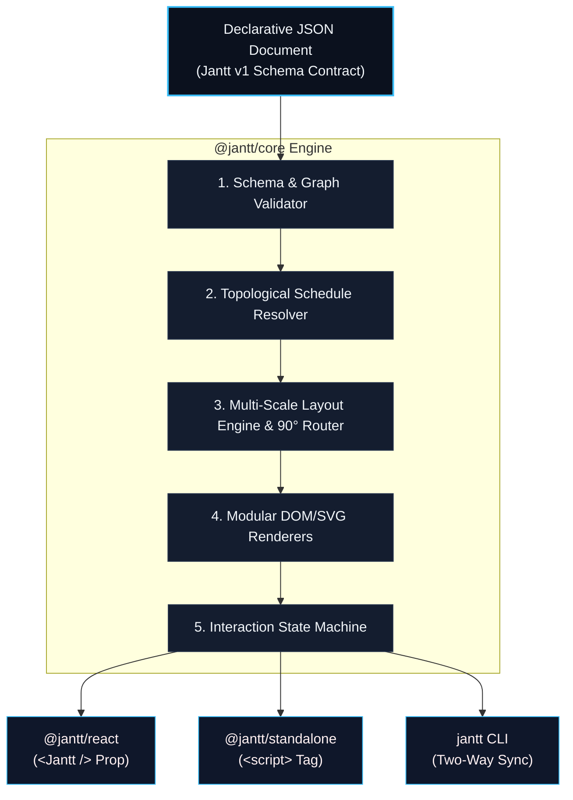

# Jantt Architecture & System Design

This document details the software architecture, design principles, module boundaries, and data flow of **Jantt — The JSON Gantt Chart Engine**.

---

## Architectural Principles

1. **JSON as the Single Source of Truth**:
   The entire application state is a single, serializable JSON document conforming to `https://jantt.dev/schema/v1.json`. There is no hidden internal runtime state that cannot be persisted back to the JSON file.
2. **Zero Runtime Dependencies**:
   `@jantt/core` contains zero third-party dependencies. All date calculations, coordinate layouts, constraint solvers, schema validators, and DOM renderers are written from first principles in pure TypeScript.
3. **Pure Functional Transformations**:
   Core scheduling, critical path, layout, and validation algorithms are pure functions: `(State, Options) => Result`. They never mutate input data.
4. **Separation of Concerns & High Cohesion**:
   - **Data Math**: Pure calendar/date manipulation in UTC.
   - **Validator**: Standalone syntax, semantic, and circular dependency checks.
   - **Resolver**: Topological constraint relaxation and early/late start float computation.
   - **Layout**: Pixel coordinate mapping, multi-scale grids, and 90° orthogonal wire routing.
   - **Controller**: Pointer event state machine.
   - **Renderers**: Modular, decoupled DOM/SVG presentation subsystems.

---

## System Overview & Monorepo Topology

---

## Subsystem Breakdown

### 1. Date Math Subsystem (`date-math.ts`)
- **Isolation**: Pure UTC calendar manipulation.
- **Key Functions**:
  - `addDays(dateStr: string, days: number): string`
  - `diffDays(startStr: string, endStr: string): number`
  - `isWeekend(dateStr: string): boolean`
  - `parseISODate(dateStr: string): Date`
  - `formatISODate(date: Date): string`
- **Timezone Safety**: Avoids `Date` local timezone offset pitfalls by anchoring all parsing and serialization strictly in UTC (`getUTCFullYear`, `getUTCMonth`, `getUTCDate`).

### 2. Schema Validator (`validator.ts`)
- **Role**: Diagnostic engine that inspects raw JSON and returns actionable errors with repair suggestions.
- **Checks Performed**:
  - Top-level schema conformity.
  - Mandatory task properties (`id`, `category`, `start`, `end`).
  - ISO-8601 calendar date validity (`YYYY-MM-DD`).
  - Range sanity (`start <= end`).
  - Category referential integrity (task categories match declared categories).
  - Dangling dependency checks (`dependsOn` refers to an existing task ID).
  - Cycle detection using depth-first graph traversal.

### 3. Schedule Resolver (`resolver.ts`)
- **Role**: Dual-mode topological pacing engine:
  - **Explicit Dependencies**: Enforces `task.start >= prereq.end + gapDays` while preserving duration.
  - **Implicit Category Pacing**: Automatically sequences unlinked tasks sharing a category chronologically.
  - **Critical Path Calculation**: Computes Early Start/Finish (ES/EF) and Late Start/Finish (LS/LF) to identify zero-float tasks that dictate project finish time.

### 4. Layout Engine (`layout.ts`)
- **Role**: Converts abstract task dates into exact pixel bounding boxes across multiple zoom scales:
  - `day` (36px/day), `week` (18px/day), `month` (7px/day), `quarter` (3px/day), `year` (1.5px/day).
- **Milestones**: Detects zero-duration or explicit milestones (`milestone: true`) and produces diamond geometry.
- **Baselines**: Calculates ghost comparison bars (`baselineLayout`).
- **90° Orthogonal Router**: Generates clean right-angle SVG paths connecting prerequisite right edge to dependent left edge.

### 5. Modular Renderers (`renderers/`)
- `toolbar.ts`: Top controls bar with title, scale switcher, critical path toggle, and search.
- `grid-table.ts`: Sticky left multi-column grid with duration, progress pill, and draggable splitter.
- `timeline-header.ts`: Hierarchical Year, Month, and Weekday/Date header tiers.
- `timeline-grid.ts`: Background grid rows, weekend shading, and today indicator.
- `dependency-links.ts`: SVG dependency lines, markers, active states, and drag-to-link preview wire.
- `task-bars.ts`: Task bars, milestone diamonds, baseline ghost bars, progress bars, and link anchor ports.
- `tooltip.ts`: Floating glassmorphic hover card.

---

## Security Architecture

- **Zero Script Execution**: Jantt does not use `eval()`, `new Function()`, or dynamic template engines.
- **HTML Sanitization**: All user strings (task labels, notes, category names) are aggressively HTML-escaped before insertion into the DOM.
- **Zero Third-Party Dependency Vulnerabilities**: Because `@jantt/core` has 0 dependencies, it is immune to upstream transitive dependency vulnerabilities.
